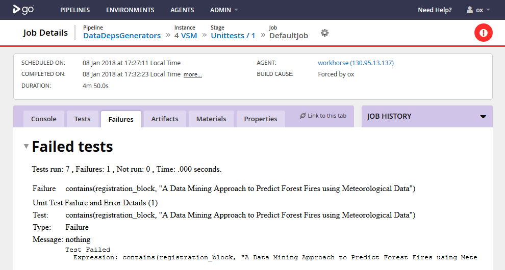

# TestReports.jl

*A JUnit XML test report generator for Julia*

This package produces JUnit XML test reports. It is for use with your CI tooling of choice,
for example a CI tool like GoCD consumes reports in this format and gives back HTML reports.

## Getting Started

The reporting is designed to enable you to write your unit tests in the standard Julia way,
that is using `test/runtests.jl` as the entry point to your tests and with default `TestSet`
types. In theory, it should also work with custom `TestSet` types - see the [Manual](@ref) for 
further information.

To test and generate a report for your package:

```julia
julia> TestReports.test("MyPackage")
# Unit tests run, report saved to testlog.xml in current working directory
```

To add to CI:

```cmd
$ julia -e 'using Pkg; Pkg.add("TestReports"); using TestReports; TestReports.test("MyPackage")'
```

Additionally, properties can be added to your `TestSet`s. To do this, use the `recordproperty`
function like so:

```julia
using Test
using TestReports

@testset "MyTests" begin
    recordproperty("ID", 1)
    @test 1==1
end
```

## The JUnit XML Schema

The JUnit XML schema is a format used by many CI tools. For a definition of the schema, see [here](https://www.ibm.com/support/knowledgecenter/en/SSQ2R2_14.2.0/com.ibm.rsar.analysis.codereview.cobol.doc/topics/cac_useresults_junit.html).

## Example of Use

Below is a screen shot of TestReports being used with [GoCD](https://github.com/gocd/gocd/),
to report an test failure in [DataDepsGenerators.jl](https://github.com/oxinabox/DataDepsGenerators.jl/).



The corresponding `testlog.xml` file (after pretty printing) is below.

```xml
<?xml version="1.0" encoding="UTF-8"?>
<testsuites name="/UCI" id="now" tests="7" failures="1" errors="0">
  <testsuite name="" id="_id_" tests="1" failures="0" errors="0">
    <testcase name="pass (info lost)" id="_testcase_id_"/>
  </testsuite>
  <testsuite name="" id="_id_" tests="1" failures="0" errors="0">
    <testcase name="pass (info lost)" id="_testcase_id_"/>
  </testsuite>
  <testsuite name="" id="_id_" tests="1" failures="0" errors="0">
    <testcase name="pass (info lost)" id="_testcase_id_"/>
  </testsuite>
  <testsuite name="" id="_id_" tests="1" failures="0" errors="0">
    <testcase name="pass (info lost)" id="_testcase_id_"/>
  </testsuite>
  <testsuite name="" id="_id_" tests="1" failures="0" errors="0">
    <testcase name="pass (info lost)" id="_testcase_id_"/>
  </testsuite>
  <testsuite name="ForestFires" id="_id_" tests="2" failures="1" errors="0">
    <testcase name="contains(registration_block, &quot;A Data Mining Approach to Predict Forest Fires using Meteorological Data&quot;)" id="_testcase_id_">
      <failure message="nothing" type="test">Test Failed
  Expression: contains(registration_block, "A Data Mining Approach to Predict Forest Fires using Meteorological Data")</failure>
    </testcase>
    <testcase name="pass (info lost)" id="_testcase_id_"/>
  </testsuite>
</testsuites>
```